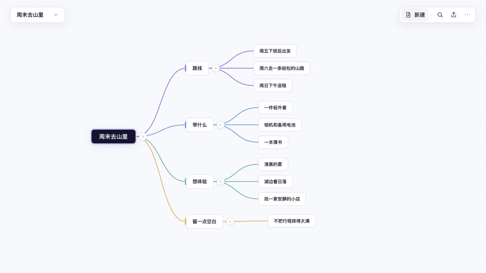

# Laniakea

快速、轻量的思维导图。打开即写，用键盘或鼠标把一个想法连续展开，不需要先创建账号、工作区或知识库。

<p align="center">
  <a href="https://tetracoralla.github.io/laniakea/"><strong>立即使用网页版</strong></a>
  ·
  <a href="https://github.com/tetracoralla/laniakea/releases/latest">查看最新版本</a>
  ·
  <a href="https://github.com/tetracoralla/laniakea/issues">反馈问题</a>
</p>



## 开始使用

### 网页版

[直接打开 Laniakea](https://tetracoralla.github.io/laniakea/)，不需要安装或登录。思维导图保存在当前浏览器中，不会上传到服务器；建议定期使用“更多 → 导出完整备份”，也可以把单张图另存为 Markdown。

清除网站数据、使用无痕窗口或更换浏览器后，未另行备份的内容可能消失。首次成功打开后，网页版也可以离线重新使用。

### macOS

当前公开版本暂未提供面向普通用户的 macOS 安装包。完成 Apple Developer 签名和公证后，DMG 会发布到 [Releases](https://github.com/tetracoralla/laniakea/releases)；在此之前请使用网页版。

## 主要能力

- 键盘与鼠标驱动的创建、导航、调整层级、重排、折叠和删除
- 稳定的树形自动布局，以及适合大图的流畅画布与视口裁剪
- 搜索、撤销与重做、多选、拖放分支和浮动分支
- CommonMark / GFM Markdown 导入、导出、渲染和结构化粘贴
- 网页版多文档、本地自动保存、完整备份与离线使用
- 桌面版 Markdown 工作文件、最近文档、全局快捷键与本地恢复

## Agent 与 Codex Plugin

Laniakea 也可以成为 Agent 与人共同维护的结构化思考界面。Codex 插件能够读取、搜索、新建和安全更新同一份 Markdown 思维导图；更新带有版本冲突保护，也不会把富 Markdown 静默改写成普通大纲。

<details>
<summary>为 Codex 添加 Laniakea</summary>

```bash
codex plugin marketplace add https://github.com/tetracoralla/laniakea.git
codex plugin add laniakea@laniakea
```

安装后请新建一个 Codex 任务，让宿主载入插件。工具边界见 [`docs/agent-tool-model.md`](docs/agent-tool-model.md)。

</details>

## 高频快捷键

| 操作 | 快捷键 |
| --- | --- |
| 创建同级 / 子节点 | `Enter` / `Tab` |
| 提升一级 | `Shift+Tab` |
| 编辑节点 | 直接输入或按空格 |
| 选择父、子、同级节点 | 方向键 |
| 移动同级顺序 | `⌘↑` / `⌘↓` |
| 折叠或展开 | `⌘/` |
| 撤销 / 重做 | `⌘Z` / `⇧⌘Z` |
| 搜索节点 | `⌘F` |
| 命令面板 | `⌘K` |

## 开源与参与

Laniakea 使用 [Apache License 2.0](LICENSE) 开源。开发、构建和验证方式见 [`CONTRIBUTING.md`](CONTRIBUTING.md)，网页部署说明见 [`docs/deployment.md`](docs/deployment.md)。

- [报告问题](https://github.com/tetracoralla/laniakea/issues/new?template=bug_report.yml)
- [提出建议](https://github.com/tetracoralla/laniakea/issues/new?template=feature_request.yml)
- [安全问题说明](SECURITY.md)

<sub>Created by openAdam.</sub>
