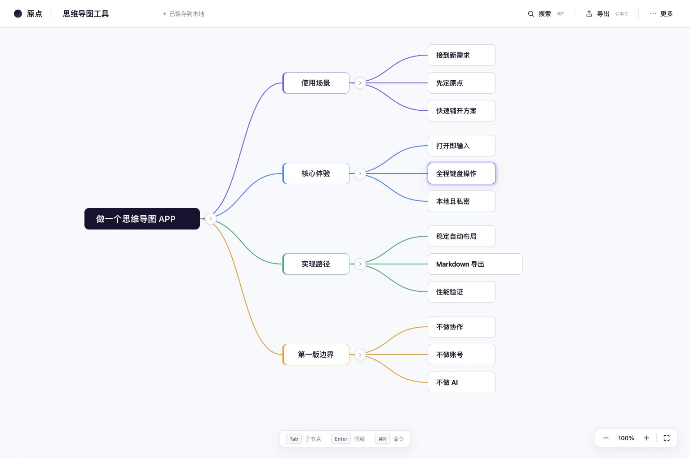

# Laniakea

快速、轻量的思维导图。打开即写，用键盘或鼠标把一个想法连续展开，不需要先创建账号、工作区或知识库。



## 主要能力

- 稳定的树形自动布局，以及适合大图的视口裁剪和画布移动
- 键盘创建、导航、调整层级、重排、折叠和删除节点
- 搜索、撤销与重做、多选、拖放分支和浮动分支
- CommonMark/GFM Markdown 渲染、导入、导出和结构化粘贴
- 网页版多文档浏览器存储、自动保存、完整备份和离线安装
- 桌面版 Markdown 工作文件、最近文档、全局快捷键和本地恢复

## 网页版

```bash
npm install
npm run dev
```

打开 <http://127.0.0.1:4173/>。正式构建：

```bash
npm run build
npm run preview
```

网页版将多张思维导图和画布状态保存在当前浏览器的 IndexedDB 中，不上传服务器，也不需要账号。界面的“保存在此浏览器”只表示浏览器存储已经写入，不表示文件已经下载或同步到云端。

请定期使用“更多 → 导出完整备份”，也可以把单张图另存为 Markdown。清除网站数据、使用无痕窗口或更换浏览器后，未另行备份的数据可能消失。支持 File System Access API 的浏览器会直接写入用户选择的 Markdown 文件；其他浏览器使用普通下载。

在线使用：<https://tetracoralla.github.io/laniakea/>。部署说明见 [`docs/deployment.md`](docs/deployment.md)。

## macOS 桌面版

```bash
npm install
npm run desktop:dev
```

构建应用与 DMG：

```bash
npm run desktop:build
```

桌面版把可持续编辑的 Markdown 作为工作文件，并在应用数据目录保存画布位置、折叠状态和恢复信息。当前本机构建采用临时签名；面向其他 Mac 分发前仍需 Apple Developer 签名与公证。

## 高频快捷键

| 操作 | 快捷键 |
| --- | --- |
| 创建同级 / 子节点 | `Enter` / `Tab` |
| 提升一级 | `Shift+Tab` |
| 编辑节点 | 直接输入或按空格 |
| 选择父、子、同级节点 | 方向键 |
| 移动同级顺序 | `⌘↑` / `⌘↓` |
| 折叠或展开 | `⌘/` |
| 撤销 / 重做 | `⌘Z` / `⇧⌘Z` |
| 搜索节点 | `⌘F` |
| 打开 / 保存 / 另存为 | `⌘O` / `⌘S` / `⇧⌘S` |
| 命令面板 | `⌘K` |

## 验证

```bash
npm run check:regression
```

涉及桌面文件、窗口、快捷键或打包行为时，再运行：

```bash
npm run check:desktop-runtime
```

开发回归、真实运行流程和产品体验验收是三个独立结论。详细产品模型见 [`docs/product-model.md`](docs/product-model.md)。

## 参与贡献

- [报告问题](https://github.com/tetracoralla/laniakea/issues/new?template=bug_report.yml)
- [提出建议](https://github.com/tetracoralla/laniakea/issues/new?template=feature_request.yml)

准备参与开发时，请先阅读 [`CONTRIBUTING.md`](CONTRIBUTING.md) 和 [`SECURITY.md`](SECURITY.md)。依赖许可概览见 [`THIRD_PARTY_NOTICES.md`](THIRD_PARTY_NOTICES.md)。

## 许可

Laniakea 使用 [Apache License 2.0](LICENSE)。

<sub>Created by openAdam.</sub>
