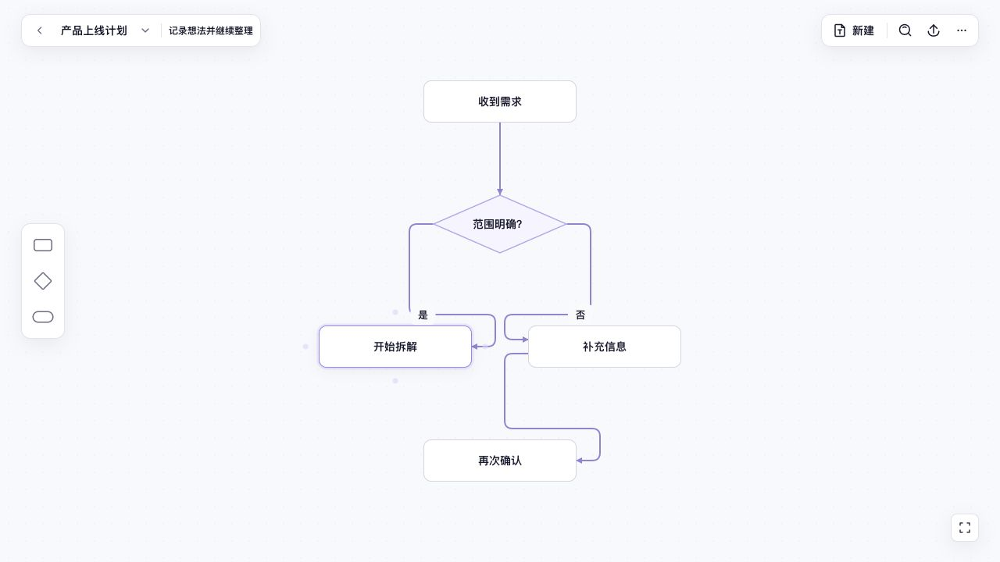

# Laniakea

从一个想法开始，展开思维导图，再把需要细化的节点下钻成独立导图或流程。打开即写，用键盘或鼠标连续整理，不需要创建账号、工作区或知识库。

<p align="center">
  <a href="https://tetracoralla.github.io/laniakea/"><strong>立即使用网页版</strong></a>
  ·
  <a href="https://github.com/tetracoralla/laniakea/releases/latest">查看最新版本</a>
  ·
  <a href="https://github.com/tetracoralla/laniakea/issues">反馈问题</a>
</p>


## 开始使用

### 网页版

[直接打开 Laniakea](https://tetracoralla.github.io/laniakea/)，不需要安装或登录。思维导图保存在当前浏览器中，不会上传到服务器；建议定期使用“更多 → 导出完整备份”，也可以把单张图另存为 Markdown。

清除网站数据、使用无痕窗口或更换浏览器后，未另行备份的内容可能消失。首次成功打开后，网页版也可以离线重新使用。

### 桌面安装包

桌面版通过 [Releases](https://github.com/tetracoralla/laniakea/releases) 提供网页下载，不需要应用商店。可用安装包以该版本附件为准；没有适用安装包时可以直接使用网页版。

Windows 用户运行 `-setup.exe`，按安装向导完成安装，应用自带 WebView2 运行环境，不需要安装 Node.js 或开发工具。当前 Windows 包没有发行者签名，系统可能显示未知发布者提示；下载前请查看 Release 的验证范围与校验和。

macOS 的交付方式是下载 `.dmg`，打开后拖到“应用程序”。公开 DMG 尚待 Developer ID 签名和公证凭据配置完成；本地临时签名包不会冒充已通过系统信任检查的公开安装包。

## 主要能力

- 键盘与鼠标驱动的创建、导航、调整层级、重排、折叠和删除
- 树形自动布局、独立浮动分支，以及大图的视口裁剪与全图概览
- 节点右键“下钻为…”：创建独立思维图或流程，返回时保留上层位置
- 流程步骤、判断、分支与汇合；方向点续接、拖线、重连、分支文字和连线样式
- 搜索、撤销与重做、多选、拖放分支和浮动分支
- CommonMark / GFM Markdown 导入、导出、渲染和结构化粘贴
- 网页版多文档、本地自动保存、完整备份与离线使用
- 桌面版 Markdown 工作文件、最近文档、全局快捷键与本地恢复

先在中心主题输入想法，按 `Tab` 展开子节点，按 `Enter` 添加同级；需要深入某一项时，
右键该节点选择“下钻为…”。返回上层后，概要节点保留入口，双击即可继续。
搜索可以直接跳到下层导图或流程中的内容。



Markdown 可带走根导图和下层空间的内容；流程坐标、视口和画布位置保留在本机。
网页版的完整备份包含全部文档与这些画布状态。当前面向桌面浏览器和横向平板，
手机端完整编辑、云同步和多人协作不在本版范围内。

## Agent 与 Codex Plugin

Laniakea 也可以成为 Agent 与人共同维护的结构化思考界面。Codex 插件能够读取、搜索、新建和安全更新同一份 Markdown 思维导图；更新带有版本冲突保护，也不会把富 Markdown 静默改写成普通大纲。工具错误提供可机器判断的 code，完整结果有 256 KiB 上下文预算；大型结构会明确截断并引导 Agent 按分支或搜索继续读取。

Agent 当前可修改根思维图；下层思维图和流程只提供有界只读预览。桌面应用与 Agent
通过明确路径的 Markdown 交接：Agent 改动后，在应用中重新打开文件读取新版本；
应用仍有未提交内容时会保护磁盘版本并提示冲突。网页版的浏览器文档不会自动暴露给本机 Agent。

已使用 Agent Host 的用户通过 Host 更新 Laniakea 组件。手动安装 Codex Plugin 的方式如下；
它需要本机 Node.js 20 或更高版本，Agent Host 安装则自带所需运行时。

<details>
<summary>为 Codex 添加 Laniakea</summary>

```bash
codex plugin marketplace add https://github.com/tetracoralla/laniakea.git
codex plugin add laniakea@laniakea
```

安装后请新建一个 Codex 任务，让宿主载入插件。工具边界见 [`docs/agent-tool-model.md`](docs/agent-tool-model.md)。

</details>

## 高频快捷键

| 操作 | 快捷键 |
| --- | --- |
| 创建同级 / 子节点 | `Enter` / `Tab` |
| 提升一级 | `Shift+Tab` |
| 编辑节点 | 直接输入或按空格 |
| 选择父、子、同级节点 | 方向键 |
| 移动同级顺序 | `⌘↑` / `⌘↓` |
| 折叠或展开 | `⌘/` |
| 撤销 / 重做 | `⌘Z` / `⇧⌘Z` |
| 搜索节点 | `⌘F` |
| 命令面板 | `⌘K` |

Windows 使用 `Ctrl` 代替表中的 `⌘`，`⇧` 表示 `Shift`。应用内菜单会按当前平台显示快捷键。

## 开源与参与

Laniakea 使用 [Apache License 2.0](LICENSE) 开源。开发、构建和验证方式见 [`CONTRIBUTING.md`](CONTRIBUTING.md)，网页部署说明见 [`docs/deployment.md`](docs/deployment.md)。
项目由个人维护，后续以可靠性、兼容性和实际使用反馈驱动的改进为主。
Flow 的端口、正交连线和交叉处理复用可独立打包的
`@openadam/graph-view-compiler`；Laniakea 仍独立拥有文档格式、布局意图、交互与渲染。

- [报告问题](https://github.com/tetracoralla/laniakea/issues/new?template=bug_report.yml)
- [提出建议](https://github.com/tetracoralla/laniakea/issues/new?template=feature_request.yml)
- [安全问题说明](SECURITY.md)

<sub>Created by openAdam.</sub>
