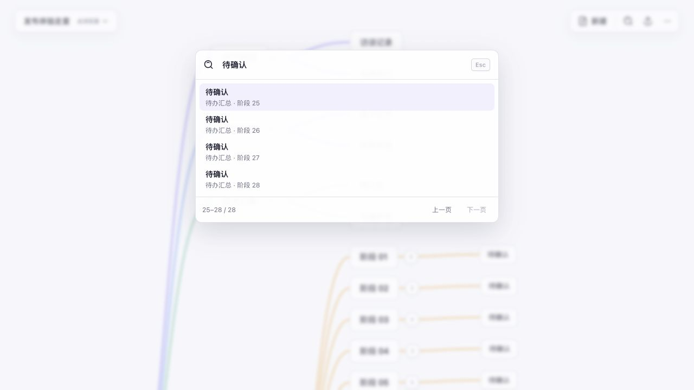
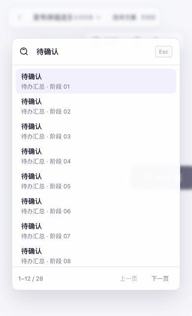

# Laniakea 全局审视与修复记录 · 2026-09-06

本次任务是审视用户场景、功能设计、架构、代码、视觉和 Agent 工程治理，修复后暂存。
开始时 main 的 HEAD 为 `d09fce3afebdc2000c9a9a3d5bd0b98c49117b42`，已有 40 个暂存文件，
未暂存区为空。本次保留这些施工成果，在其上检查和修复；没有调用其他 reviewer 或模型。

## 整体判断

单一编辑器、Markdown 内容来源、按需下钻的 Map/Flow，以及复用内容模型的四个 Agent
工具，是一致且值得保留的产品方向。问题主要发生在日常任务的衔接：找到内容以后能否
真正到达、异步等待中新增的内容归谁、另存以后究竟写到哪里，以及有界输出是否被误当成
完整能力。已有大量回归并没有覆盖这些组合，起始开发回归通过后仍复现了实质缺陷。

本轮据此集中修复任务中断与数据边界，改善检索和小窗口的可用性。没有为“架构优化”
拆出第二套模型，也没有增加仪表盘、治理状态栏或与记录工作无关的常驻 UI。

| 审视维度 | 判断与本次处理 |
| --- | --- |
| 用户场景 | 新建、记录、搜索、下钻、返回、保存和继续编辑有完整入口；补上重复搜索结果、折叠子图目标，以及文件等待期间继续输入的断点。 |
| 功能设计 | 明确来源与可写文件、草稿迁移与用户文件副本的区别；浏览器 rich source 统一下载有明确名称的副本，删除依赖临时句柄“恢复原件”的危险绕行。 |
| 架构 | 保存正文、草稿迁移和绑定更新归到同一保存队列；打开/新建/导入在共同激活边界处理晚到编辑；两种结果选择层复用一个分页状态模型。 |
| 代码质量 | 补齐每个受影响异步等待点的会话判断、保留已提交摘要、清理过期恢复状态；输入对象严格拒绝未知字段。移除只约束旧截断行为的无用函数及测试，保留输入法和无障碍回归。 |
| UI 视觉 | 延续现有轻量画布；搜索名称与上下文改为两行，提高小字对比度；分页支持指针和键盘，小窗口保持输入、结果和分页出口可见；窄屏顶部操作可换行。 |
| Agent 治理 | 将长篇历史配方收敛成用户任务与风险；取消用固定探索条数、全套性能项目和空报告栏目证明完成的倾向；启动脚本明确只证明隔离构建和启动。 |

## 已修复的具体问题

1. **搜索与流程选择永久截断。** 搜索只显示前 12 项、流程目标只显示前 20 项。重复
   名称无法靠缩小关键词找到后面的结果。现在渲染仍有界，但上下键、PageUp/PageDown
   和分页按钮可访问全部匹配；换页后输入保持焦点，活动项滚入可见区域。
2. **搜索进入折叠子图后只改变选择。** Map Space 中目标的祖先仍折叠，用户看不到
   命中的内容。现在在该 Space 中展开祖先，再合并回同一份文档；真实 App 入口回归
   和浏览器下钻/折叠/返回/搜索序列均观察到目标可见。
3. **浏览器旧请求写入另一份文档。** 保存等待 `createWritable` 后直接读取当前文档，
   可能把新文档写入旧请求的文件；旧 `getFile` 完成后还能重新发起已被取代的打开。
   现在重新检查会话或切换代次，并中止过期输出流，不提交晚到内容。
4. **保存和草稿迁移竞争。** 草稿移动原先在保存队列外，排队自动保存可能重建旧稿，
   晚到移动可能覆盖新文档绑定。现在整个过程串行，普通保存执行时使用最新绑定。
   源正文提交而移动失败时仍保留新摘要，以便重试；另存回当前文件也保留冲突检查。
   恢复内容成功另存后清除过期的“放弃恢复”状态。
5. **切换等待期间的后续输入没有保存。** 切换前仅等待某次保存，并不足以覆盖保存、
   目标准备及激活期间的编辑。现在持续核对离开文档的最新版本；只有保存与激活间
   没有新增内容且请求仍有效时才安装目标文档。新增回归分别阻塞创建和激活，验证
   两段等待中的输入都先保存。
6. **rich source 的“保护”反过来可能覆盖原件。** 原逻辑在选择文件前读取一份旧字节，
   选择原文件后尝试写回这份快照；这可能抹去期间的外部更新。刷新后句柄又会丢失。
   现在保护依据来自持久化来源标记，浏览器直接下载带 ` - Laniakea.md` 后缀的副本。
   普通大纲继续使用原生保存面板。这是对既有“原件不被降级”要求的实现调整。
7. **草稿识别写死 macOS 正式版路径。** 在真实 Verify.app 中，“另存为”实际复制
   草稿而没有移动，旧文件仍在。现在启动时读取当前宿主数据目录；无法取得目录时
   保守保留原件。单测覆盖验证版、自定义 Linux 目录、Windows 分隔符及路径边界；
   macOS 实测确认旧稿消失、新文件和活动绑定一致。
8. **Agent 拼错字段后仍然写入。** 实际 MCP 请求中的 `dry_run: true` 曾被静默丢弃，
   随后的更新直接提交。现在 schema 拒绝顶层和操作对象的未知字段，递归节点也只
   接受 `text` / `children`。真实传输检查包含该拼写、操作额外字段和深层 `chidlren`
   拼写，均返回错误并保持原文件字节不变。
9. **窗口边界与视觉阅读问题。** 搜索结果上下文过小且挤在右侧；面板高度没有扣除
   顶部留白，760×520 下分页按钮落到窗口外；工作区最小宽度又把窄屏内容挤出。
   现已分开标题/上下文、修正可用高度和工作区尺寸，并让顶部控件在窄屏换行。

新断言来自上述可复现行为、既有数据保留与连续状态要求，以及本次明确的安全下载
设计。没有把旧“前 12/20 条就结束”的断言改成另一个静默截断阈值。治理文档的缩减
不删除对应交互功能，精确历史用例继续由既有回归保留。

## 实际验证

- **开发回归 PASS：** 当前 `npm run check:regression`，67 个测试文件、571 项测试；
  Web 构建、MCP 类型与构建、发行文件检查及 54 项 Rust 测试通过。
- **仓库内 Agent 载体 PASS：** 对本次生成的插件 server 执行真实 stdio 调用，检查
  四工具发现、创建/读取/搜索、dryRun、原子更新、冲突、rich-source 保护、完整请求/
  结果预算，以及 40 轮跨进程写入；新增未知字段负向请求在此链路验证。
- **浏览器实测 PASS（下列范围）：** 原生粘贴 Markdown；28 个同名结果到达第 25–28
  项、分页后输入焦点；Map 创建/编辑/折叠/返回/搜索展开；Flow 创建步骤和判断、返回
  概要、刷新后通过搜索进入同一流程并看到连线。1280×720、760×520 和 390×640
  检查搜索与顶部布局，窄屏最终页面宽度为 390，没有 680px 工作区溢出。
- **隔离桌面实测 PASS（下列范围）：** 新构建 `Laniakea Verify.app` 使用独立 bundle ID
  与数据目录。原生粘贴、自动草稿、另存迁移、旧路径清理、继续编辑、编辑态退出、
  进程结束、重启读回、外部修改冲突、从失败提示另存副本均已执行。原始外部版本
  保留外部新增内容；副本保留应用内修改；活动绑定指向副本。

最后构建后再次恢复到冲突副本，并在外部修改后通过原生面板选择同一路径、确认替换；
应用仍显示冲突，文件保留外部追加内容。这一补充流程确认另存没有绕开当前文件的
版本检查。桌面脚本已改为输出 `isolated desktop launch only`；交互结论来自实际 UI
与文件读回，不能由脚本输出推导。

## 范围与剩余判断

- 当前产品仍是本地思考工具。协作、云同步、任务分派没有成为本次隐含新增的产品。
  Agent 目前只修改根思维图；子 Space 是有界只读预览，不能完整展开任意大子图，也
  不能独立搜索/编辑其内容。这是明确的能力覆盖差异，不能宣传为完整的人机功能对等。
- 浏览器流的会话取消、rich-source 刷新保护和保存等待的故障顺序有 DOM 回归；没有
  把这些可控等待测试说成每一种真实浏览器文件面板都已实测。窄屏布局经过观察，未
  宣称移动设备全部触控手势或全部覆盖层完成兼容验收。
- 未验证 Windows/Linux 安装态、发行签名/公证、系统授权拒绝与重建后的权限身份，
  未更新 `/Applications/Laniakea.app` 或用户安装的插件；上一轮交付止于暂存，未推送或发布。
- 本轮没有做同环境大图帧率与尾延迟 before/after，因此没有新增“更流畅”或
  “10,000 节点体验已通过”的结论。开发和技术判断不代表用户已表达最终体验接受。

过程日志、初始暂存补丁、失败复现和磁盘读回位于本机
`/tmp/laniakea-global-20260905-221334/`。关键改动以源码和可重复回归为准，截图只是
本次视觉观察。初始暂存树 `4ca6e5a6dbf68ef407dd86c9ddf69818314548b9` 可区分此前施工
与本次新增修改。

## 用户 review 后的提交复核

用户随后补充小 review 和改进，并授权收口提交。当前候选保留全部 66 个暂存路径，
MCP 检查结果说明补上实际已覆盖的未知字段拒绝。重新执行完整开发回归，67 个测试
文件、571 项前端测试、54 项 Rust 测试以及实际 MCP 传输与 40 轮跨进程检查均通过；
构建后的插件产物与暂存内容一致。此次没有追加应用逻辑修改，沿用上面同一版应用
代码的浏览器和隔离桌面流程记录，不将其描述为本次重新实测。复核没有发现阻碍本地
提交的问题；授权范围不包含推送、发布或替换安装版。

本次提交前回归日志位于 `/tmp/laniakea-closure-20260906/regression.log`。
